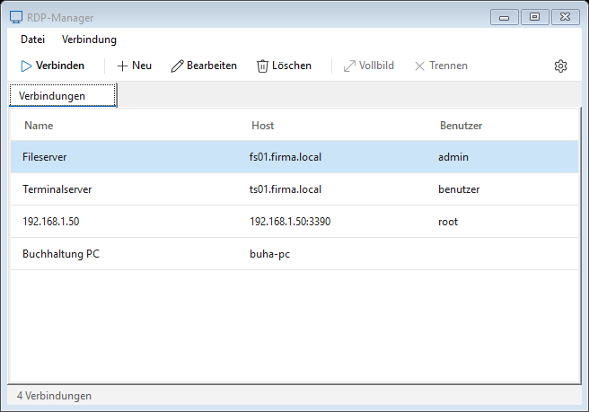

# RDP-Manager

Ein schlanker Verbindungsmanager für Remotedesktop (RDP) unter Windows, geschrieben in VB.NET / WinForms.



## Funktionen

- **Verbindungsliste** mit Name, Host, Port und Benutzer – anlegen, bearbeiten, löschen
- **Sitzungen als Tabs** direkt im Programm (Microsoft RDP Client Control), inkl.
  - dynamischer Anpassung der Auflösung beim Vergrößern des Fensters
  - Vollbild, Zwischenablage, automatischem Wiederverbinden
  - Meldung mit „Erneut verbinden“ bei Verbindungsabbruch
- Alternativ **extern mit `mstsc.exe`** öffnen (z. B. für mehrere Monitore)
- **Passwörter sicher gespeichert** in der Windows-Anmeldeinformationsverwaltung
  (`TERMSRV/<host>`, wie bei mstsc) – nie in Dateien oder im Code
- Moderne, flache Oberfläche im Stil von Windows 11 mit Segoe-Fluent-Icons
- Tastenkürzel: `Enter` verbinden, `Strg+N` neu, `F2` bearbeiten, `Entf` löschen

## Bedienung

| Aktion | So geht's |
|---|---|
| Verbinden | Doppelklick, `Enter` oder „Verbinden“ |
| Tab schließen | `×` auf dem Tab oder Mittelklick |
| Extern öffnen | Rechtsklick → „Extern öffnen (mstsc)“ |
| Einstellungen | Zahnrad oben rechts |

### Einstellungen

- **Verbindungen in Tabs öffnen** – aus: es wird `mstsc.exe` gestartet
- **Gespeichertes Passwort automatisch übergeben** – aus: Windows fragt bei jeder Verbindung nach
- **Beim Verbinden mit mstsc.exe minimieren** – das Fenster kommt nach dem Schließen der Sitzung wieder hoch

## Wo liegen die Daten?

| Was | Wo |
|---|---|
| Verbindungsliste | `%APPDATA%\RDP-Manager\connections.xml` (ohne Passwörter) |
| Passwörter | Windows-Anmeldeinformationsverwaltung, Ziel `TERMSRV/<host>` |
| Einstellungen | `user.config` unter `%LOCALAPPDATA%` (Standardort für .NET-Anwendungseinstellungen) |

Gespeicherte Passwörter lassen sich unter *Systemsteuerung → Anmeldeinformationsverwaltung → Windows-Anmeldeinformationen* einsehen und löschen.

## Voraussetzungen

- Windows 10 oder 11 (64 Bit)
- .NET Framework 4.7.2 oder neuer (unter Windows 10/11 vorinstalliert)
- Für eingebettete Sitzungen mit dynamischer Auflösung: Zielserver ab Windows 8.1 / Server 2012 R2
  (ältere Server werden skaliert dargestellt)

## Bauen

Mit Visual Studio 2019 oder neuer `RDP-Manager.sln` öffnen und starten – oder auf der Kommandozeile:

```bash
msbuild RDP-Manager.sln -p:Configuration=Release
```

Die Exe liegt danach unter `RDP-Manager\bin\Release\`. Die beiden DLLs `AxMSTSCLib.dll` und `MSTSCLib.dll` müssen neben der Exe liegen (werden beim Build automatisch kopiert).

### Zu `lib/`

`AxMSTSCLib.dll` und `MSTSCLib.dll` sind .NET-Wrapper für das RDP-ActiveX-Control von Windows (`mstscax.dll`). Sie lassen sich jederzeit neu erzeugen:

```bash
cd RDP-Manager/lib
"C:\Program Files (x86)\Microsoft SDKs\Windows\v10.0A\bin\NETFX 4.8 Tools\AxImp.exe" C:\Windows\System32\mstscax.dll
```

## Projektstruktur

| Datei | Aufgabe |
|---|---|
| `Connection.vb` | Datenklasse einer Verbindung |
| `ConnectionStore.vb` | Laden/Speichern der Verbindungsliste (XML) |
| `CredentialStore.vb` | Passwörter in der Windows-Anmeldeinformationsverwaltung |
| `RdpSessionPage.vb` | Ein Tab mit eingebetteter RDP-Sitzung |
| `FlatTabControl.vb` | Tab-Leiste mit Schließen-Kreuz |
| `Theme.vb` | Farben, Icons und Styling |
| `MainForm`, `ConnectionDialog`, `SettingsForm` | Fenster |

## Lizenz

[MIT](LICENSE)
